

An extended gallery of my original origami designs. They are in chronological order by the date designed. Please contact me before distributing or teaching these models.

## Index

[Hanging up the Mask - 10 Grid](#hanging-up-the-mask)
[Ship in a Bottle - 18 Grid](#ship-in-a-bottle)
[Ermine - 14 Grid](#ermine)
[Sky's the Limit - 18 Grid](#skys-the-limit)
[Sinking Feeling - 18 Grid](#sinking-feeling)
[Stargazing - 16 Grid](#stargazing)
[Whitetail Fawn - 22.5](#whitetail-fawn)
[Fish out of Water - 14 Grid (Partial 28ths)](#fish-out-of-water)
[Hanging by a Thread - 20 Grid](#hanging-by-a-thread)
[Even Littler Dragon - 6 Grid](#even-littler-dragon)
[Mandrake - 16 Grid](#mandrake)
[Sea Serpent - Grafted Fish Base](#sea-serpent)
[Mermaid - 16 Grid](#mermaid)
[Phoenix - Grafted Bird Base](#phoenix)
[Trophy Hunting - Fish Base](#trophy-hunting)
[Fairy - 16 Grid](#fairy)
[Wikipedia Sword and Shield - 16 Grid](#wss)

  

    
    <h1>Hanging up the Mask</h1>
    
Comedy never looked so grim. On a related note, properly shaping this model is a nightmare, probably because I'm bad at masks.

    
Designed: 06/28/25

  

  

   
  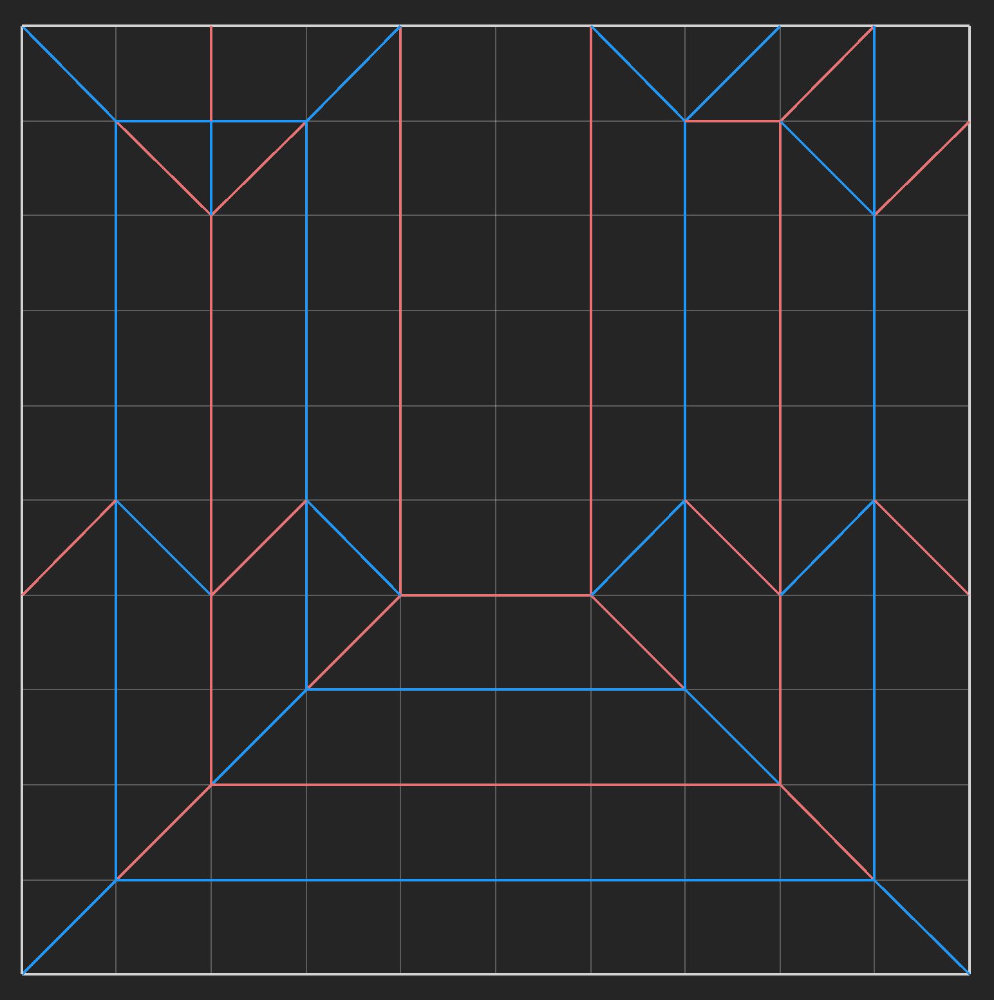 
  

  

    
    <h1>Ship in a Bottle - 18 Grid</h1>
    
I suppose it's technically only half a bottle, but if I made the whole bottle, then you wouldn't be able to see the ship.

    
Designed: 06/02/25

  

  

  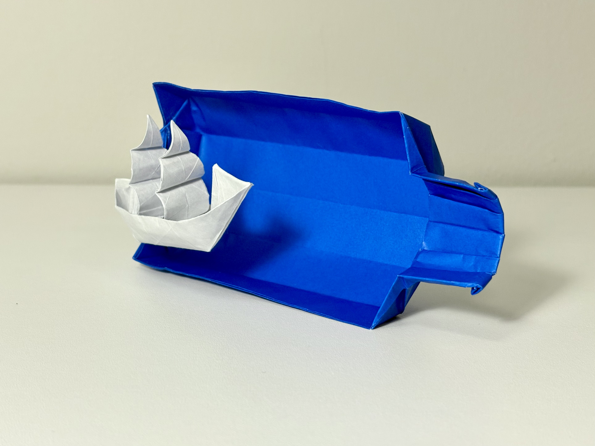 
   
  

  

    
    <h1>Ermine - 14 Grid</h1>
    
Is it a stoat or an ermine? Never could figure out the difference. In any case, the design is excessively difficult for something so simple.

    
Designed: 05/28/25

  

  

  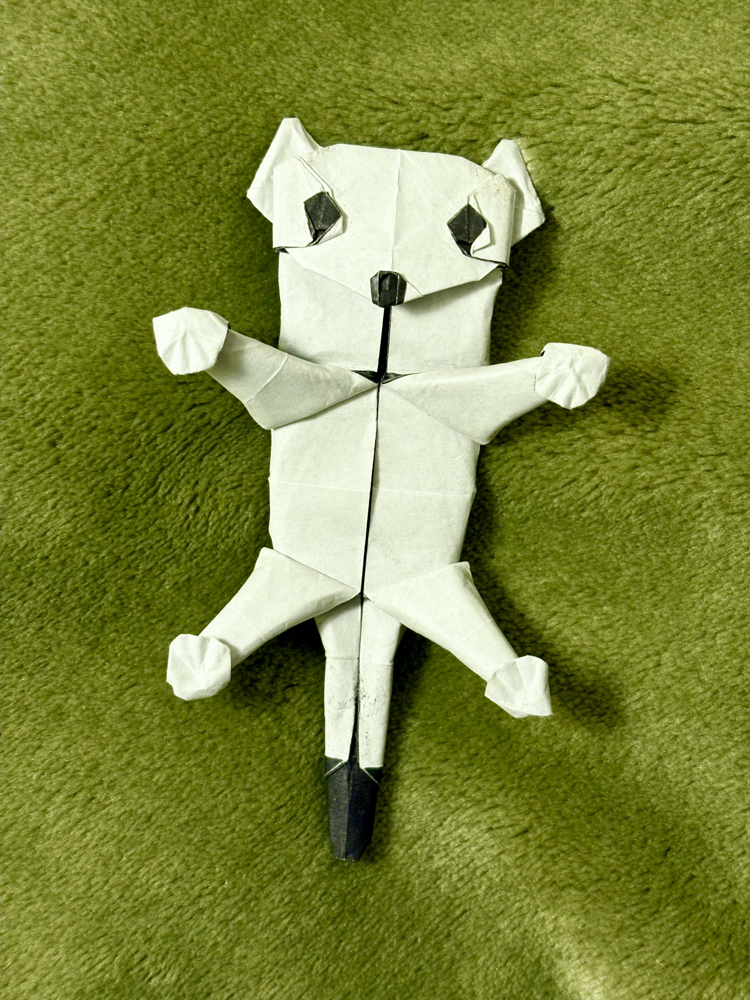 
  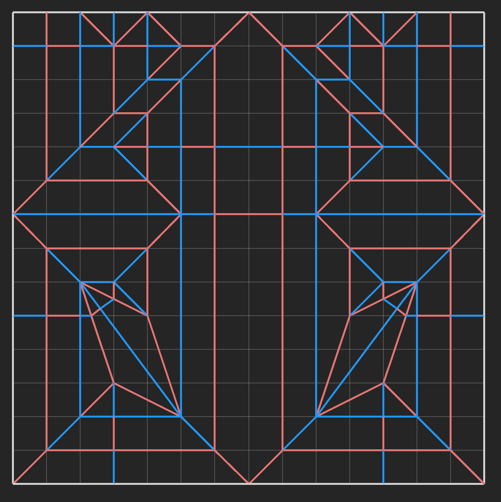 
  

  

    
    <h1>Sky's the Limit - 18 Grid</h1>
    
In the same vein as Sinking Feeling, this is meta origami with a non-standard model. I wanted this model to focus on youthful imagination, as I know I would have loved this as a kid. Also, yes, it does fly.

    
Designed: 05/10/25

  

  

   
  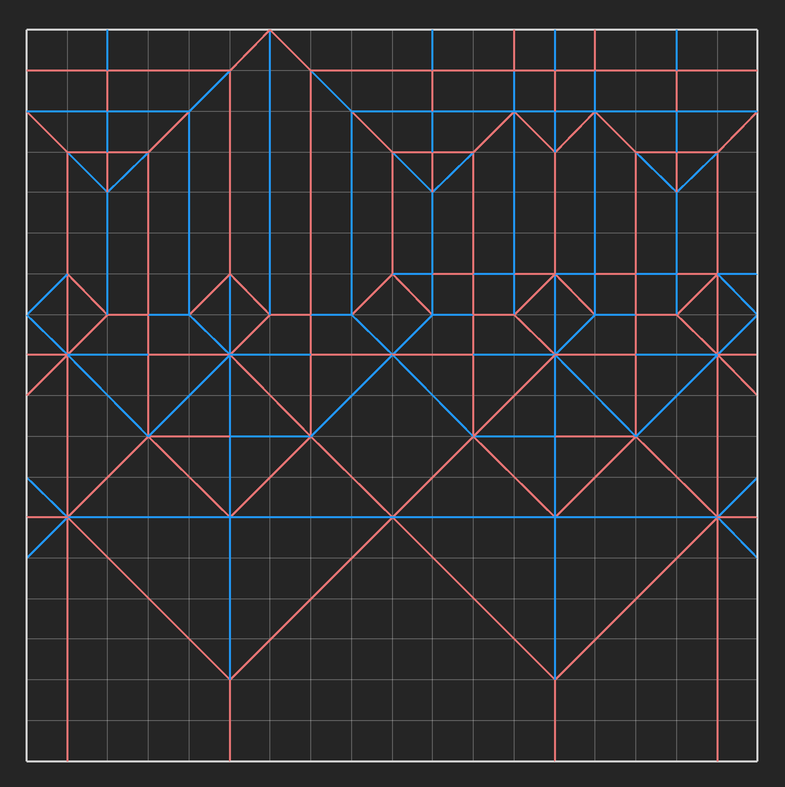 
  

  

    
    <h1>Sinking Feeling - 18 Grid</h1>
    
Meta origami models are so fun, but they typically focus on cranes or blank pieces of paper. There are very few models that incorporate the traditional boat, so I designed a model that had two. The title is a double entendre for the sink fold.

    
Designed: 09/20/24

  

  

  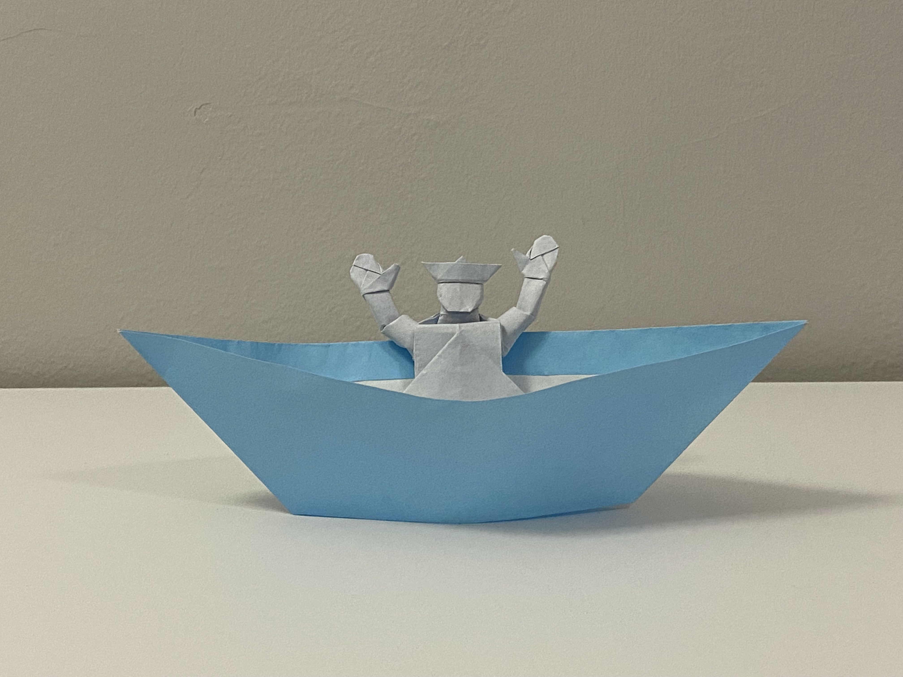 
   
  

  

    
    <h1>Stargazing - 16 Grid</h1>
    
Alternate title: the universe observing itself. Origami seems like a fitting medium for this idea, since both the observer (telescope) and the universe (night sky) are folded from the same sheet of paper. Designing a piece that is its own background was an interesting challenge.

    
Designed: 09/06/24

  

  

  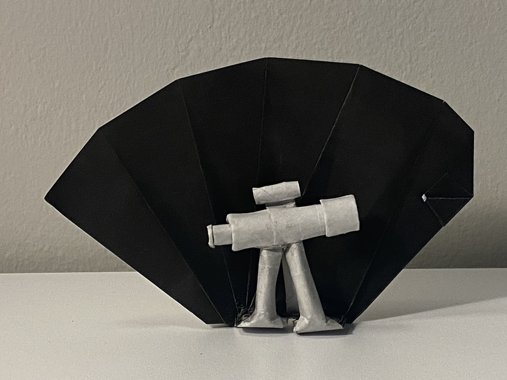 
   
  

  

    
    <h1>Whitetail Fawn - 22.5&deg;</h1>
    
Designed as a celebration of the past summer, I took a slight departure from my previous subjects and paradigms. The result is this simple baby deer.

    
Designed: 08/18/24

  

  

   
   
  

  

    
    <h1>Fish out of Water - 14 Grid (Partial 28ths)</h1>
    
A bit of an absurdist take on the phrase, I wanted to use my humanoid design skills to make the fish vaguely anthropomorphic. The partial 28ths can be treated as open sinks during the folding sequence, though I still recommend precreasing them. The umbrella uses a similar structure to the one in "Walking in the Rain" by Chen Xiao.

    
Designed: 08/14/24

  

  

   
   
  

  

    
    <h1>Hanging by a Thread - 20 Grid</h1>
    
Won the July 2024 Origami-Dan design contest. To some degree, I was inspired by Banksy's "Girl with Balloon", which informed my color choice in the final fold.

    
Designed: 07/24/24

  

  

  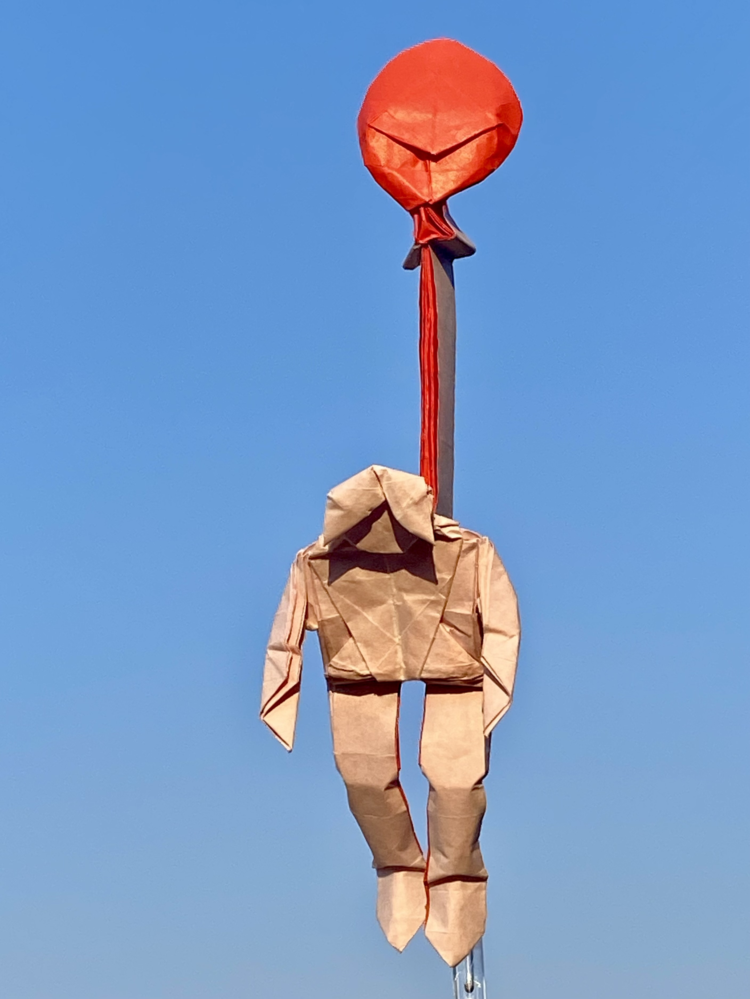 
   
  

  

    
    <h1>Even Littler Dragon - 6 Grid</h1>
    
Designed at the OUSA 2024 convention. After seeing that Boice Wong was selling diagrams for his Little Dragon (8-grid), I wanted to see if I could design a dragon even smaller. This one is very efficient, but if you're looking for a fun, low-grid origami dragon, just go buy his diagrams.

    
Designed: 07/20/24

  

  

  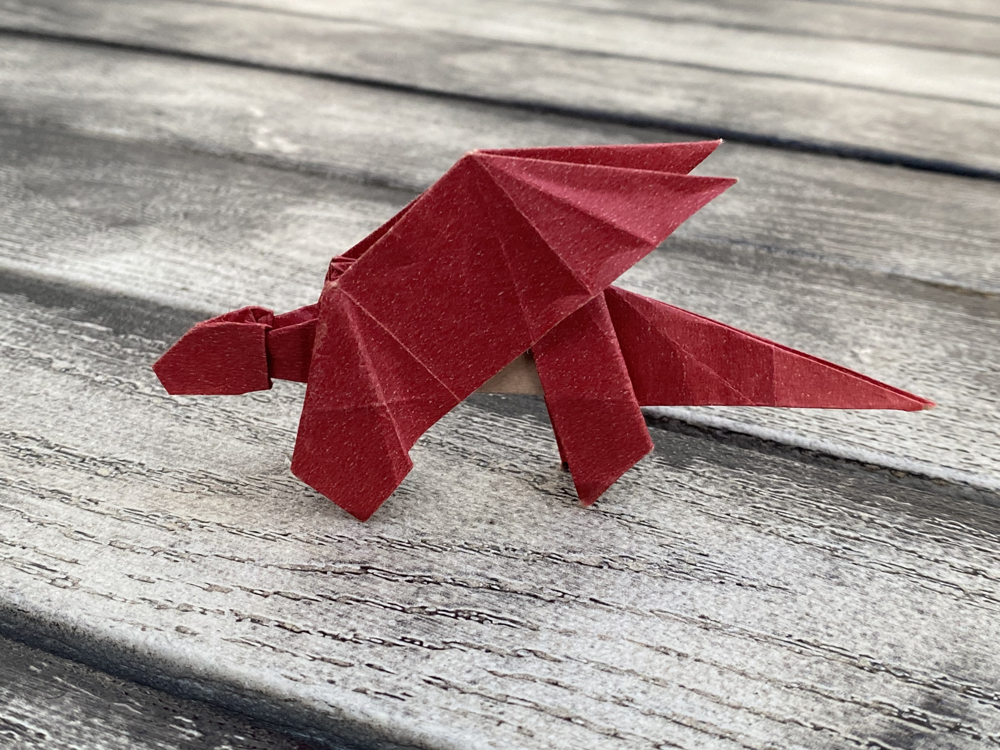 
  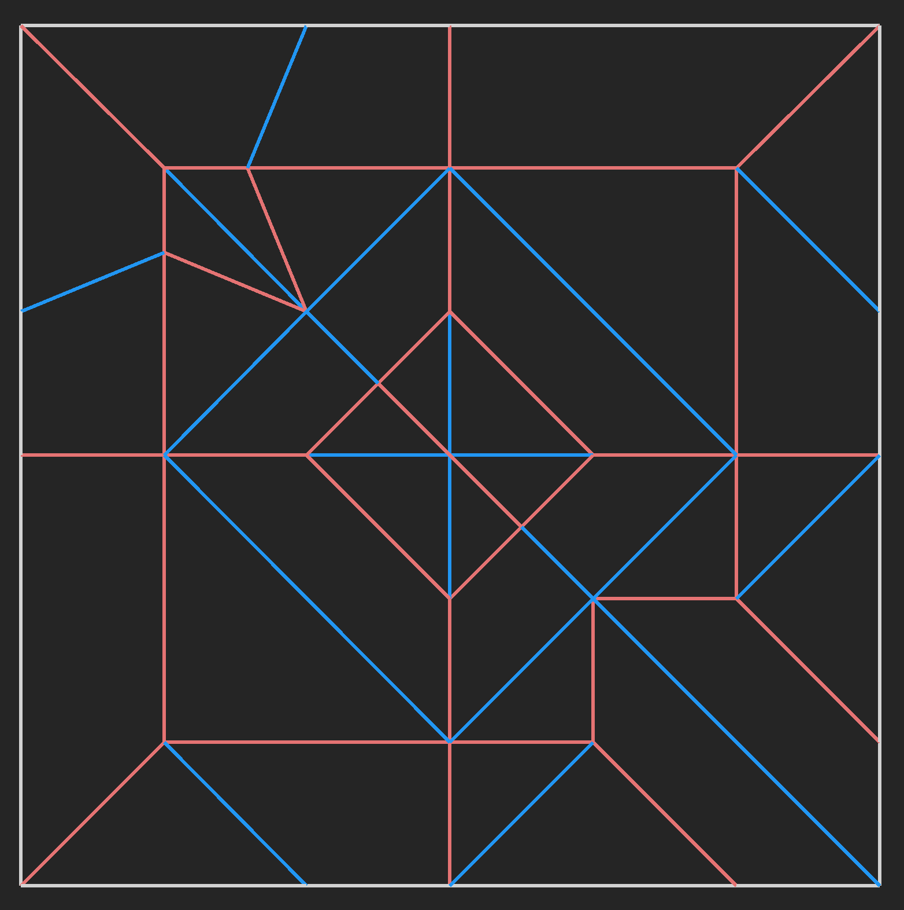 
  

  

    
    <h1>Mandrake - 16 Grid</h1>
    
A cute, little asymmetric root vegetable. This design focuses more heavily on the mythical interpretation of the plant, but you could just as easily shape it to look like a potato.

    
Designed: 06/07/24

  

  

  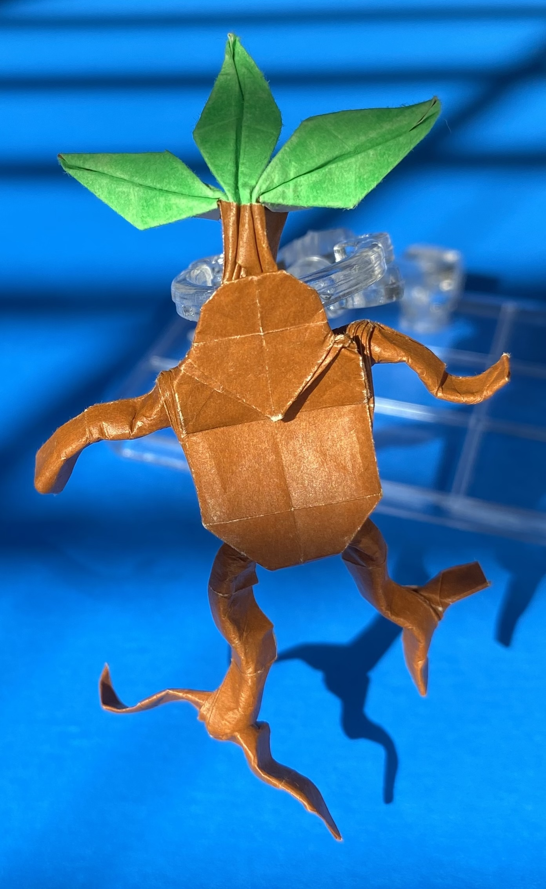 
  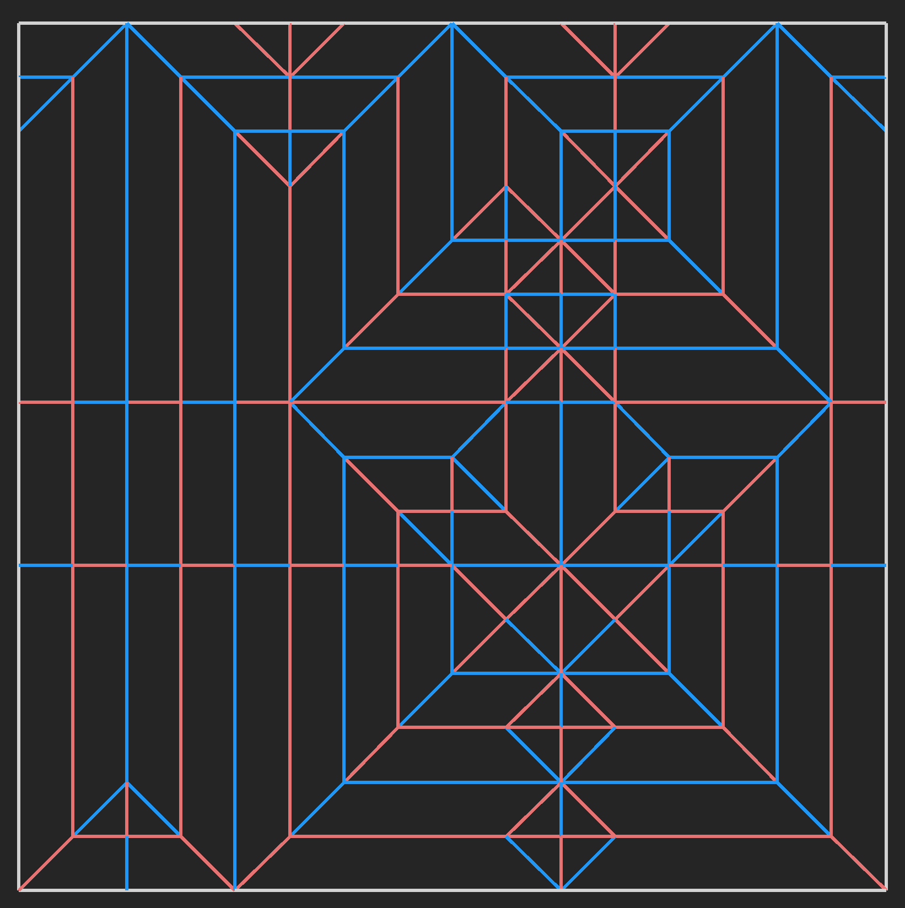 
  

  

    
    <h1>Sea Serpent - Grafted Fish Base</h1>
    
It took a while to nail down the final structure and proportions, but it was time well spent. The reference for the grafts on the top and left of the CP is 3/16ths the width of the paper. Finished the design on the same day as my mermaid.

    
Designed: 05/11/24

  

  

   
   
  

  

    
    <h1>Mermaid - 16 Grid</h1>
    
I suppose this is is technically a merperson, since I didn't aim to imply a particular gender with this design. The trident makes the structure very asymmetrical. Finished the design on the same day as my sea dragon.

    
Designed: 05/11/24

  

  

   
   
  

  

    
    <h1>Trophy Hunting - Fish Base</h1>
    
What started as a sketch of an elephant head turned into something much more. Trophy hunting as a broader concept is a contentious subject with a lot of philosophical nuance. Admittedly, this piece doesn't really engage much of that discourse; it's a paper elephant head.

    
Designed: 05/01/24

  

  

  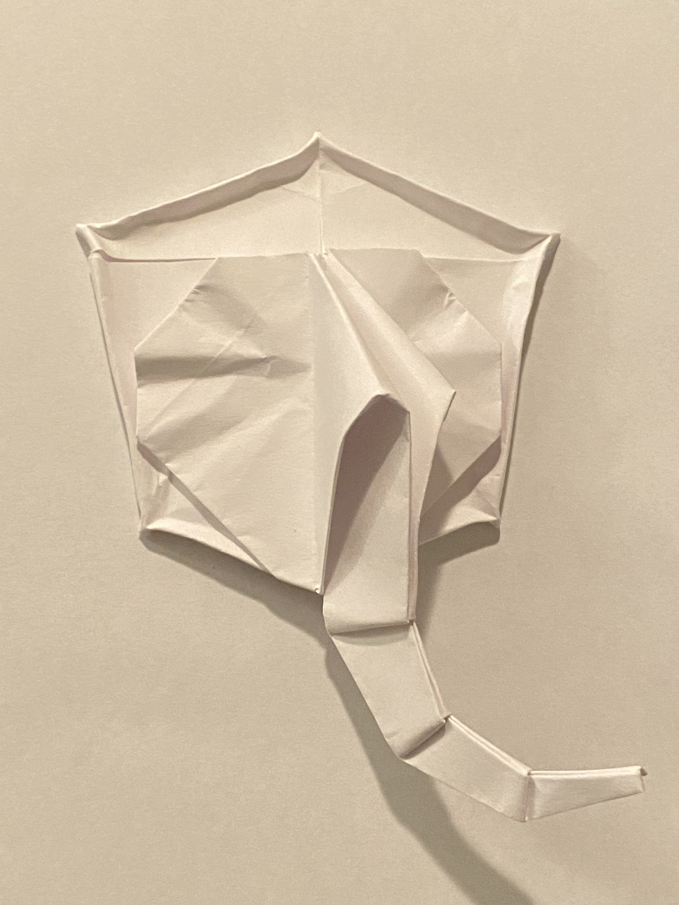 
   
  

  

    
    <h1>Phoenix - Grafted Bird Base</h1>
    
Designed for university graduation, I wanted to render our school's mascot using origami. The braided tail uses the same structure as Satoshi Kamiya's phoenix. The references for the CP are that the corners of the bird base lie on the 1st and 5th grid lines of an 8-grid.

    
Designed: 04/28/24

  

  

   
   
  

  

    
    <h1>Fairy - 16 Grid</h1>
    
I received a lot of negative feedback on this design, which was ultimately for the best. I've used the criticisms to improve subsequent designs. 

    
Designed: 04/06/24

  

  

   
  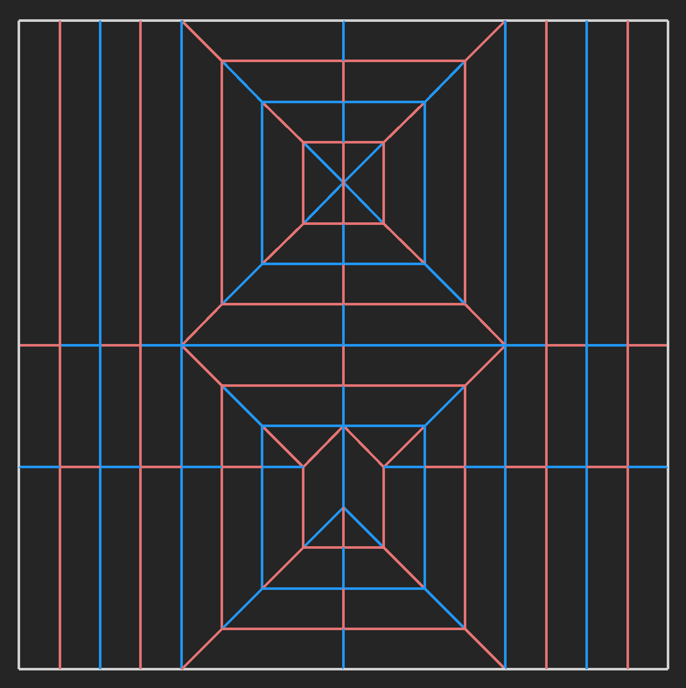 
  

  

    
    <h1>Wikipedia Sword and Shield - 16 Grid</h1>
    
I don't claim this design as my own. On the Wikipedia page for Crease Patterns, there's this unfinished CP of a swordman. It was added by the user Nicoguaro, but I couldn't find the original shaping, so I took a crack at finishing the CP and folding it myself.

    
Found: 03/29/24

  

  

  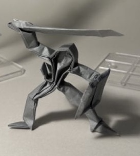 
  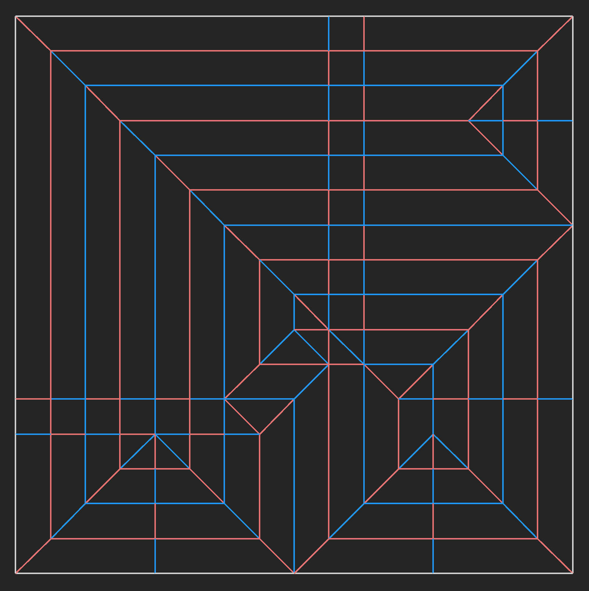 
  

Gallery layout credit to [Boice Wong](https://www.obb.design/c).