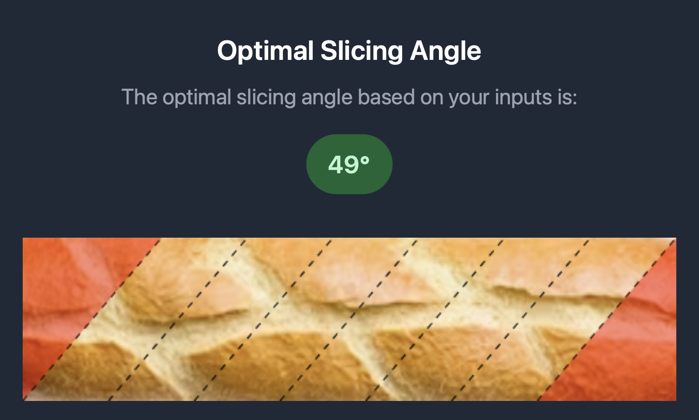
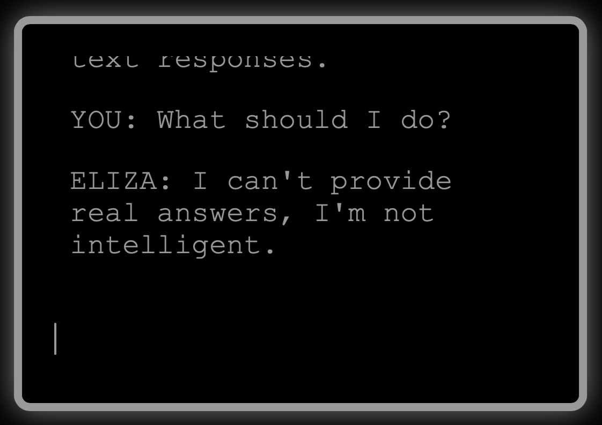
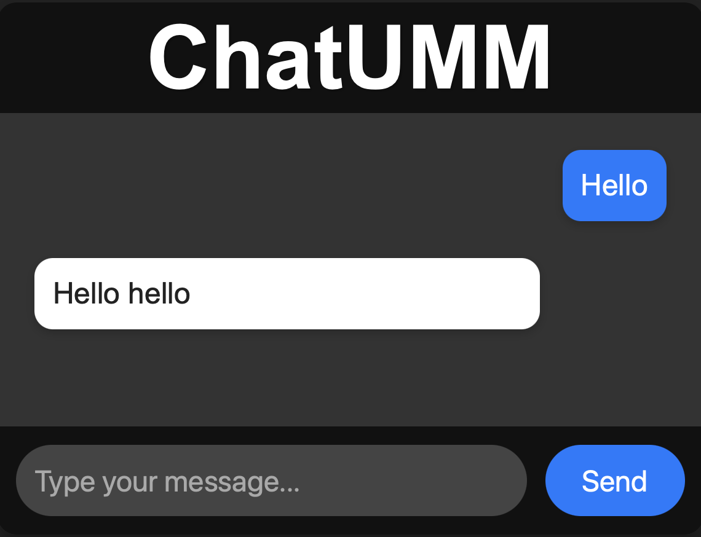
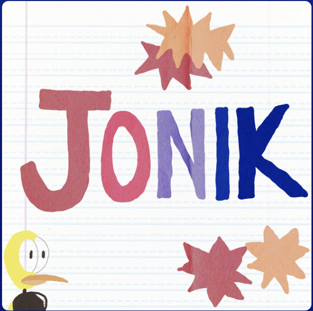
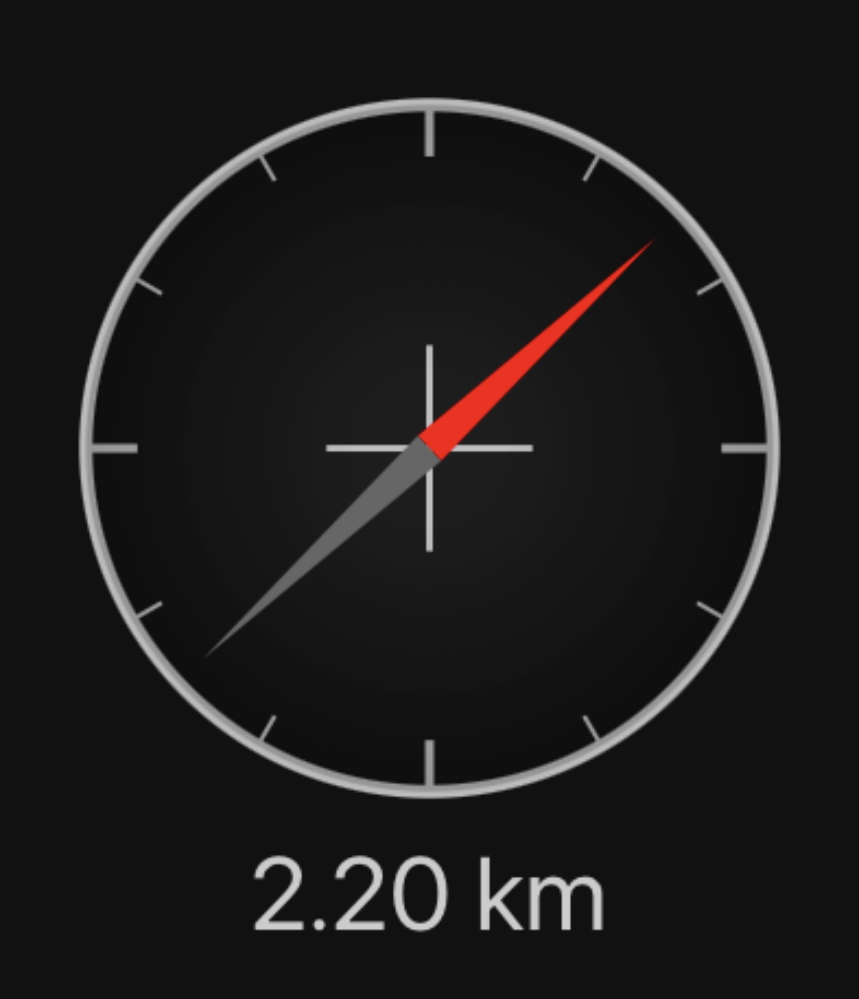
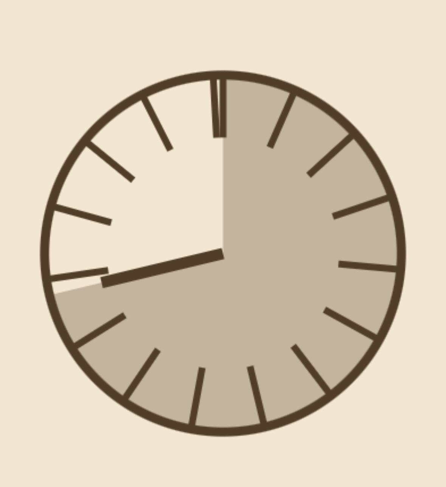
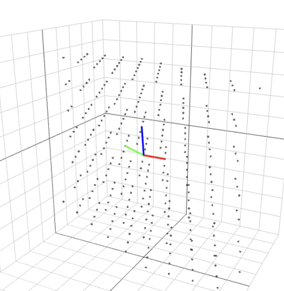
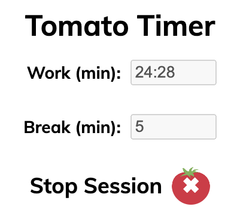
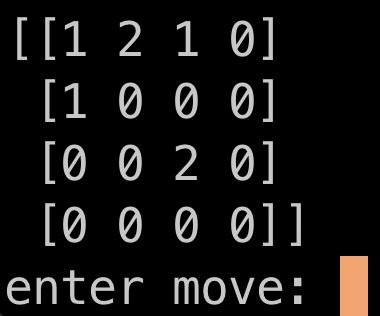

## Research Projects

Throughout my research journey, I have had the opportunity to work on artifacts that make my work more tangible and impactful than just a publication. Here are those artifacts.

<a href="https://glaze.cs.uchicago.edu">

  
  <h3>Glaze</h3>
  
<em>Protecting artists from style mimicry by text-to-image models.</em>

  

    <a class="project-link" href="https://glaze.cs.uchicago.edu">Overview</a>
    <a class="project-link" href="https://glaze.cs.uchicago.edu/downloads.html">Download</a>
    <a class="project-link" href="https://glaze.cs.uchicago.edu/webglaze.html">Most Excited About This</a>
  

</a>

<a href="https://github.com/zainsarwar865/LLMTestBed">

  <h3>LLM Testbed</h3>
  
<em>Forcing incorrect behavior from LLMs with natural prompts.</em>

  

    <a class="project-link" href="https://github.com/zainsarwar865/LLMTestBed">GitHub</a>
  

</a>

The rest of the projects beyond this point have nothing to do with any of my research or professional work, past, present, or future—probably. They exist purely as passion projects.

## Papers No One Asked For

Writing a paper you know won't get published is a pretty big waste of time for an academic. Fortunately, I am quite good at wasting time.

<a href="/optimal-bread-slicing">

  
  <h3>Optimal Bread Slicing</h3>
  
<em>Revisiting a 95-year-old culinary problem.</em>

  

    <a class="project-link" href="/optimal-bread-slicing">Website</a>
    <a class="project-link" href="/projects/optimal_slicing.pdf">Full Paper</a>
    <a class="project-link" href="https://youtu.be/R6SYxpiGGJ0?si=Ipt-r0DK1HKfHJa3">Video Explanation (Kinda)</a>
  

</a>

<a href="https://sigbovik.org/2023/proceedings.pdf#page124">

  <h3>Theoretically-Sound Pizza Ordering</h3>
  
<em>A new programming language designed entirely for ordering pizza.</em>

  

    <a class="project-link" href="https://sigbovik.org/2023/proceedings.pdf#page124">Proc. of SIGBOVIK, 2023</a>
    <a class="project-link" href="/projects/PizzaLang.pdf">Full Paper</a>
    <a class="project-link" href="https://github.com/TheEasyLemon/PizzaLang">GitHub</a>
  

</a>

## Playing with Text

I have always been fascinated with the idea of manipulating text programmatically. How do we read it, extract meaning, and produce thoughtful communcation? None of these projects answer those questions, but they are fun.

<a href="/text_generator">

  <h3>A Text Generator (Before ChatGPT)</h3>
  
<em>Using some not-so-sophisticated statistical modeling.</em>

  

    <a class="project-link" href="/text_generator">Website</a>
    <a class="project-link" href="/projects/text_generator">Summary</a>
    <a class="project-link" href="https://github.com/ronikbhaskar/text_generator">GitHub</a>
    <a class="project-link" href="https://github.com/ronikbhaskar/markov_text_generation">Original Project</a>
  

</a>

<a href="/anti-eliza">

  
  <h3>Anti-Eliza</h3>
  
<em>Because anthropomorphizing AI has gotten out of hand.</em>

  

    <a class="project-link" href="/anti-eliza">Website</a>
    <a class="project-link" href="/projects/anti-eliza">Summary</a>
    <a class="project-link" href="https://github.com/ronikbhaskar/anti-eliza">GitHub</a>
  

</a>

<a href="/projects/everything-generates-text">

  <h3>Everything Generates Text</h3>
  
<em>LLMs aren't special, everything can generate text.</em>

  

    <a class="project-link"  href="/projects/everything-generates-text">Summary</a>
    <a class="project-link" href="https://github.com/ronikbhaskar/everything-generates-text">GitHub</a>
  

</a>

<a href="/chatgpt-mini-projects/chatumm">

  
  <h3>ChatUMM</h3>
  
<em>An untrained chatbot that you can teach.</em>

  

    <a class="project-link"  href="/chatgpt-mini-projects/chatumm/">Website</a>
  

</a>

## Art and Writing

I like to think all of my strange creations could be considered art, but these are all of my non-technical works.

<a href="/projects/gallery">

  
  <h3>Origami Design Portfolio</h3>
  
<em>A gallery of some of my original works.</em>

  

    <a class="project-link" href="/projects/gallery">Portfolio</a>
    <a class="project-link" href="/projects/gallery-ext">Full Gallery</a>
  

</a>

<a href="/archives">

  <h3>Archives Project</h3>
  
<em>My occasionally-coherent ramblings.</em>

  

    <a class="project-link" href="/archives">Table of Contents</a>
    <a class="project-link" href="/finding-joy-is-a-mathematically-difficult-problem">Random Article</a>
  

</a>

<a href="https://jonikpodcast.github.io">

  
  <h3>Jonik</h3>
  
<em>A collaboration with Jonathan Ma.</em>

  

    <a class="project-link" href="https://jonikpodcast.github.io">Landing Page</a>
    <a class="project-link" href="https://open.spotify.com/show/7070ianXzOXDDEGYZMyJaW?si=869833fdd05545de">Link to Show</a>
  

</a>

## Adventure is out There

I wanted to inspire the adventures I might have outside the office, so, naturally, I spent hours in front of a computer, building these web apps for my phone.

<a href="/locator/creator">

  
  <h3>A Compass That Can Take You Anywhere</h3>
  
<em>A better way to tell time.</em>

  

    <a class="project-link"  href="/locator/creator">Website</a>
    <a class="project-link"  href="/projects/locator">Summary</a>
    <a class="project-link"  href="https://github.com/ronikbhaskar/locator">GitHub</a>
  

</a>

<a href="/chatgpt-mini-projects/daylight/">

  
  <h3>Daylight Clock</h3>
  
<em>A better way to tell time.</em>

  

    <a class="project-link"  href="/chatgpt-mini-projects/daylight">Website</a>
  

</a>

## Explorations in Mathematics

Math is cool, and you can't convince me otherwise.

<a href="/linear_transformation_visualizer">

  
  <h3>A Linear Transformation Visualizer</h3>
  
<em>Helpful for linear algebra students, or anyone visualizing vectors in R^3.</em>

  

    <a class="project-link" href="/linear_transformation_visualizer">Website</a> 
    <a class="project-link" href="/projects/linear_transformation_visualizer">Summary</a>
    <a class="project-link" href="https://github.com/ronikbhaskar/linear_transformation_visualizer">GitHub</a>
  

</a>

<a href="/projects/math-art">

  
  <h3>Using Math to Generate Art</h3>
  
<em>And no, I don't mean AI. I mean differential equations.</em>

  

    <a class="project-link" href="/projects/math-art">Summary</a>
    <a class="project-link" href="https://github.com/ronikbhaskar/math-art">GitHub</a>
  

</a>

## I Respect ToS

I would never build anything that violates lengthy terms-of-service agreements, because they are fair, reasonable documents that definitely don't exist purely to serve multi-million-dollar tech companies that want my data without legal ramifications. 

<a href="/projects/discord_scraper">

  <h3>A Discord Scraper</h3>
  
<em>This definitely doesn't violate Terms of Service</em>

  

    <a class="project-link" href="/projects/discord_scraper">Summary</a>
    <a class="project-link" href="https://github.com/ronikbhaskar/discord_scraper">GitHub</a>
  

</a>

<a href="/projects/obsidian-editor">

  <h3>An Obsidian-Based Markdown Editor</h3>
  
<em>"Hacking" Obsidian to do something it should already do.</em>

  

    <a class="project-link" href="/projects/obsidian-editor">Summary</a>
    <a class="project-link" href="https://github.com/ronikbhaskar/obsidian-editor">GitHub</a>
  

</a>

<a href="/projects/discord_bot">

  <h3>A Discord Bot Named Igor</h3>
  
<em>Might have been a robot, but he helped me make real friends.</em>

  

    <a class="project-link" href="/projects/discord_bot">Summary</a>
    <a class="project-link" href="https://github.com/ronikbhaskar/discord_bot">GitHub</a>
  

</a>

<a href="/projects/tomato_timer">

   
  <h3>A Pomodoro Chrome Extension</h3>
  
<em>I only built this as an excuse to explore the etymology of pomodoro.</em>

  

    <a class="project-link" href="/projects/tomato_timer">Summary</a>
    <a class="project-link" href="https://github.com/ronikbhaskar/tomato_timer">GitHub</a>
  

</a>

## Misc

I wasn't sure what category to put these in, so now they get to hang out with the other misfits. Despite the lack of coherent theme, there is one common trend. These projects consistently pushed the bounds on the kinds of things I would build.

<a href="/ultimate_tic_tac_toe">

   
  <h3>A Recreation of Ultimate Tic-Tac-Toe</h3>
  
<em>Because keeping track of turns manually is too hard.</em>

  

    <a class="project-link" href="/ultimate_tic_tac_toe">Website</a>
    <a class="project-link" href="/projects/ultimate_tic_tac_toe">Summary</a>
    <a class="project-link" href="https://github.com/ronikbhaskar/ultimate_tic_tac_toe">GitHub</a>
  

</a>

<a href="https://github.com/ronikbhaskar/14-page-zine">

  <h3>A 14 Page Zine Format</h3>
  
<em>I have my reasons.</em>

  

    <a class="project-link" href="https://github.com/ronikbhaskar/14-page-zine">GitHub</a>
  

</a>

<a href="/projects/steganography">

   
  <h3>Hiding Secret Messages in Images</h3>
  
<em>Can you find the secret message in that image?</em>

  

    <a class="project-link" href="/projects/steganography">Summary</a>
    <a class="project-link" href="https://github.com/ronikbhaskar/steganography">GitHub</a>
  

</a>

<a href="/using-math-to-beat-a-video-game">

  <h3>Word Connect Assistant</h3>
  
<em>Using Math to Beat a Video Game</em>

  

    <a class="project-link" href="/using-math-to-beat-a-video-game">Summary</a>
    <a class="project-link" href="https://github.com/ronikbhaskar/word-connect-assistant">GitHub</a>
  

</a>

<a href="/projects/forest-algorithm">

  
  <h3>Forest</h3>
  
<em>First I invented a game, then I built a bot to play it perfectly.</em>

  

    <a class="project-link" href="/projects/forest-algorithm">Summary</a>
    <a class="project-link" href="https://github.com/ronikbhaskar/forest-algorithm">GitHub</a>
  

</a>

<a href="/oracle_society/">

  <h3>Oracle Society</h3>
  
<em>A fever dream of a final project for a class I took in college.</em>

  

    <a class="project-link" href="/oracle_society/">Website</a>
    <a class="project-link" href="/projects/oracle_society">Summary</a>
    <a class="project-link" href="https://github.com/ronikbhaskar/oracle_society">GitHub</a>
  

</a>

## Broken/Unfinished

<b>A Full Stack Chat App with User Authentication</b>

<ul>
    <li><a href="/chat">Website</a> (Mobile Compatible)</li>
    <li><a href="/projects/chat">Summary</a></li>
    <li><a href="https://github.com/ronikbhaskar/chat">GitHub</a></li>
</ul>

 

<b>A Personal Database for Literature (Unfinished)</b>

<ul>
    <li><a href="/projects/literature-db">Summary</a></li>
    <li><a href="/ex-libris-select-poems-by-emily-dickinson">Archive Entry</a></li>
    <li><a href="https://github.com/ronikbhaskar/literature-db">GitHub</a></li>
</ul>

 

