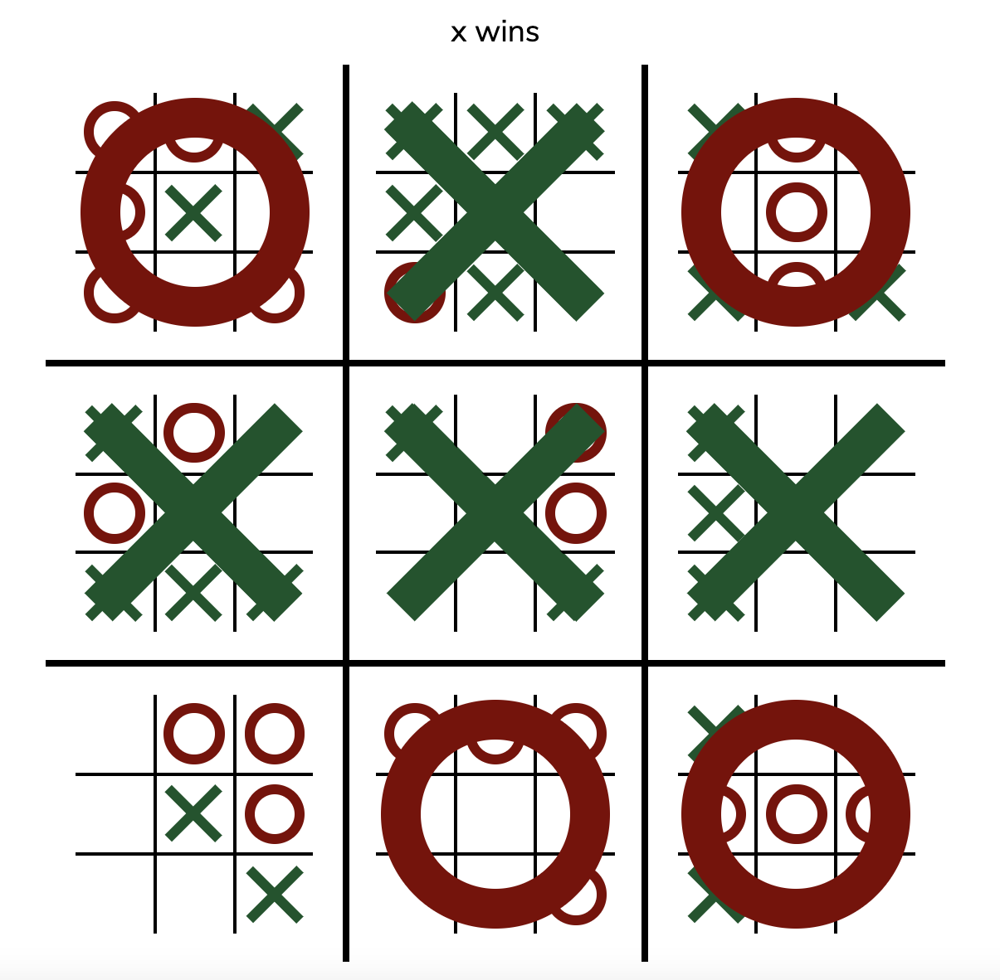

## [Archives](/archives)

I've temporarily moved the [Archives](/archives) writing project from the menu. I'll reorganize soon, but for now, I need to prioritize being a PhD applicant.

## Research With Tangible Products

<b>Glaze</b>

<ul>
    <li><a href="https://glaze.cs.uchicago.edu">Overview</a></li>
    <li><a href="https://glaze.cs.uchicago.edu/downloads.html">Download</a></li>
    <li><a href="https://glaze.cs.uchicago.edu/webglaze.html">Most Excited About This</a></li>
</ul>

 

## Projects With Websites 

<b>A Full Stack Chat App with User Authentication</b>

<ul>
    <li><a href="https://ronikbhaskar.github.io/chat">Website</a> (Mobile Compatible)</li>
    <li><a href="/projects/chat">Summary</a></li>
    <li><a href="https://github.com/ronikbhaskar/chat">GitHub</a></li>
</ul>

 

<b>A Linear Transformation Visualizer</b>

<ul>
    <li><a href="https://ronikbhaskar.github.io/linear_transformation_visualizer">Website</a> (Not Mobile Compatible)</li>
    <li><a href="/projects/linear_transformation_visualizer">Summary</a></li>
    <li><a href="https://github.com/ronikbhaskar/linear_transformation_visualizer">GitHub</a></li>
</ul>

 

<b>A Text Generator Using Markov Chains</b>

<ul>
    <li><a href="https://ronikbhaskar.github.io/text_generator">Website</a> (Mobile Compatible)</li>
    <li><a href="/projects/text_generator">Summary</a></li>
    <li><a href="https://github.com/ronikbhaskar/text_generator">GitHub</a></li>
    <li><a href="https://github.com/ronikbhaskar/markov_text_generation">Original Python Project</a></li>
</ul>

 

<b>A Recreation of Ultimate Tic-Tac-Toe</b>

 
<ul>
    <li><a href="https://ronikbhaskar.github.io/ultimate_tic_tac_toe">Website</a> (Mobile Compatible)</li>
    <li><a href="/projects/ultimate_tic_tac_toe">Summary</a></li>
    <li><a href="https://github.com/ronikbhaskar/ultimate_tic_tac_toe">GitHub</a></li>
</ul>

 

<!-- 

<b>Text-Based Game to Teach Oracles (CW: violence, kidnapping, murder)</b>

<ul>
    <li><a href="https://ronikbhaskar.github.io/oracle_society/">Website</a> (NOT Mobile Compatible)</li>
    <li><a href="/projects/oracle_society">Summary</a></li>
    <li><a href="https://github.com/ronikbhaskar/oracle_society">GitHub</a></li>
</ul>

  -->

## Projects Without Websites

<b>I Made My Own Programming Language</b>

<ul>
    <li><a href="https://sigbovik.org/2023/proceedings.pdf#page124">Published in the SIGBOVIK Proceedings 2023</a></li>
    <li><a href="/projects/PizzaLang.pdf">Full Paper (Pre-Print)</a></li>
    <li><a href="https://github.com/TheEasyLemon/PizzaLang">GitHub</a></li>
</ul>

 

<b>Inventing a Game, Then Building a Bot to Play It Perfectly</b>

<ul>
    <li><a href="/projects/forest-algorithm">Summary</a></li>
    <li><a href="https://github.com/ronikbhaskar/forest-algorithm">GitHub</a></li>
</ul>

 

<b>Some Pretty GIFs Made With Differential Equations</b>

 
<ul>
    <li><a href="/projects/math-art">Summary</a></li>
    <li><a href="https://github.com/ronikbhaskar/math-art">GitHub</a></li>
</ul>

 

<b>Hiding Secret Messages in Images</b>

 
<ul>
    <li><a href="/projects/steganography">Summary</a></li>
    <li><a href="https://github.com/ronikbhaskar/steganography">GitHub</a></li>
    <li>Can you find the secret message in that image?</li>
</ul>

 

<b>A Discord Bot Named Igor</b>

<ul>
    <li><a href="/projects/discord_bot">Summary</a></li>
    <li><a href="https://github.com/ronikbhaskar/discord_bot">GitHub</a></li>
</ul>

 

<b>"Hacking" Obsidian and Making it a Markdown Editor</b>

<ul>
    <li><a href="/projects/obsidian-editor">Summary</a></li>
    <li><a href="https://github.com/ronikbhaskar/obsidian-editor">GitHub</a></li>
</ul>

 

<b>A Discord Scraper That Definitely Doesn't Violate Terms of Service</b>

<ul>
    <li><a href="/projects/discord_scraper">Summary</a></li>
    <li><a href="https://github.com/ronikbhaskar/discord_scraper">GitHub</a></li>
</ul>

 

<b>A Chrome Extension for the Pomodoro Technique</b>

<ul>
    <li><a href="/projects/tomato_timer">Summary</a></li>
    <li><a href="https://github.com/ronikbhaskar/tomato_timer">GitHub</a></li>
</ul>

 